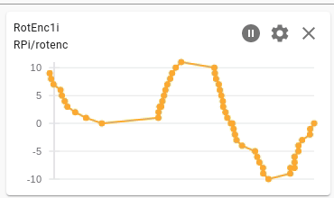

<link rel="stylesheet" href="./images/sj4u.css"></link>

# [STEM Just 4 U Home Page](https://stemjust4u.com/)
## This project involves listening for when an incremental rotary encoder knob is turned along with detecting a button press. 

You won't know the absolute position, a potentiometer or absolute encoder is better for that, but you can detect the direction and change in position.  (A rotary encoder gives digital output vs the analog output of a potentiometer )The unique part of a rotary encoder knob is that you have infinite rotation and high precision, you can count each click when the knob is turned. Possible applications are sending a servo position, motor speed, volume, etc. 

[Link to Project Web Site](https://github.com/stemjust4u/RotaryEncoder)  

   
[By Sagsaw at English Wikipedia - Transferred from en.wikipedia to Commons., Public Domain](https://commons.wikimedia.org/w/index.php?curid=61795514)  
  

## Materials 
* RPi
* esp32
* Rotary Encoder (360 degree rotary encoder, incremental)
​​
### Rotary Encoder
A change in position is translated to a digital output signal by having two internal contacts that create an open/closed circuit as you turn the knob. Basic operation involves getting the current state (will be 0 or 1) of the two pins and then using polling or an interrupt handler to monitor for a change in the pin state. Since the contacts are offset, out-of-phase, you can determine the direction by paying attention to which state each pin changed to. The concept of a quadrature encoder will also be useful later if you want to monitor the speed, rpm, of a motor. By attaching an optical encoder and comparator (LM393) you can count how many state changes are happening per second (frequency) and convert that to rpms.

  
[By Sagsaw at English Wikipedia - Transferred from en.wikipedia to Commons., Public Domain](https://commons.wikimedia.org/w/index.php?curid=22725391)  

## Polling vs interrupt handler
There are a couple different methods you can use to monitor for a press of the button and the state change in the encoder pins, polling or interrupt.

Polling is the simple while True: loop used in the main loop of many projects. It is a serial process. Each time your code loops it steps thru each part of your code and when it reaches your rotary_encoder step it will check the state of the pins. If they have changed you count it as a 'click' in the knob. The problem with this strategy is if you have a lot of other functions in your code you could miss some 'clicks' of the knob while other steps in your code are being executed. 

>Polling example below - a button press or pin state change could be missed while the processor is busy executing the other_functionsA/B.

```main_loop()
while True:  
    click = encoder() # go get pin states, check if they changed  
    button = button_press() # go get button state, check if it changed
    if click or button:
       # action based on a click or button press
    other_functionA()
    other_functionB()
```

Interrupt or ISR (interrupt service routine) or IRQ (interrupt request). The advantage to an ISR is that it is a parallel process where it monitors for an event change on a piece of hardware or pin even while your code is running other functions.  When the event change is detected (ie a button pressed or knob turned) it stops momentarily to process that event. The disadvantage is it requires extra setup and your code does pause while you're processing the event (so you want to keep the 'event handler' short).

Creating an ISR (configure an event-detect and link it to a handler/callback)
1. Configure the ISR/IRQ (event detect). You tell it which hardware (which pin) to monitor, the type of trigger (rising, falling, or both) and then what to do or how to 'handle' the event (your callback or handler function)
2. In your callback/handler function you code what should happen when the system detected a trigger event on the pin you specified. Since your code will be stopped at this point you want to keep it short. It could be a simple boolean update to indicate the event was detected.

>ISR example (note - the trigger = GPIO.BOTH. It will trigger on either a rise or fall. But you can specify RISING or FALLING to only trigger on one) 
```
import RPi.GPIO as GPIO
GPIO.add_event_detect(encoderPin1, GPIO.BOTH, callback=pin1_handler)
GPIO.add_event_detect(encoderPin2, GPIO.BOTH, callback=pin2_handler)
GPIO.add_event_detect(button, GPIO.BOTH, callback=button_handler)

def pin1_handler(channel):
  pin1_changed = True

def pin2_handler(channel):
  pin2_changed = True

def button_handler(channel):
  button_changed = True

main_loop()
    if pin1_changed or pin2_changed or button_changed:
      # action based on a click or button press
    other_functionA()
    other_functionB()
```

In my code for this project I used polling to monitor the encoder rotation (click) and an interrupt to monitor for the button. Status of the encoder is sent via mqtt.

esp32 example for a button press
```
import machine
from machine import Pin
def button_callback(pin):
    button_changed = True

button = Pin(pin, Pin.IN, Pin.PULL_UP)
button.irq(trigger=Pin.IRQ_FALLING | Pin.IRQ_RISING, handler=button_callback)

main_loop()
    if button_changed:
        # action based on a button press
```
In addition can disable/enable the irq. You would disable if you want to make adjustments to the boolean or a counter without the ISR over-riding it. Then enable when done.
```
state = machine.disable_irq()
 # code here
machine.enable_irq(state)
```

>Using interrupts will be useful in other projects. The advantage of being able to monitor a hardware event while your code is executing (in parallel) is worth the time required to setup the callback functions.
# Connections

  
[Chart is from MQTT Explorer](http://mqtt-explorer.com/)

The rotary encoder I have has 5 connections. 
1. CLK = knob rotation pin1, GPIO pin (input)
2. DT = knob rotation pin2, GPIO pin (input)
3. SW = Button press, GPIO pin (input)
4. \+ = 3.3V for RPi/esp32
5. GND = Ground

For the button you need to use a physical pull up/down resistor or the internal resistor on the RPi/esp32. Otherwise the state will be floating resulting in it bouncing around.

RPi - For Rpi2 I used pin 24 for the button and pins 17, 27 for the knob rotation.

esp32 - For esp32 I used pin 4 for the button and pins 5, 18 for the knob rotation.

>General Troubleshooting - I was having problems detecting a button press. When I measured the voltage on the pin when pulled high it was only 0.8V (pin was damaged). If you're having problems use a meter to check the voltages and make sure the hardware is ok. 

Use internal DOWN/UP resistor to confirm GPIO pin is 0-3.3V with a multimeter.  
RPi
```import RPi.GPIO as GPIO
GPIO.setmode(GPIO.BCM)
GPIO.setup(pin, GPIO.IN, pull_up_down=GPIO.PUD_UP) # 3.3V and then confirm DOWN is 0V
GPIO.cleanup()
```
esp32
```
pincheck = Pin(pin, Pin.IN, Pin.PULL_UP) # 3.3V and then confirm DOWN is 0V​
```

(see wiki link on [Pull-up_resistor](https://en.wikipedia.org/wiki/Pull-up_resistor) - For a switch that connects to ground, a pull-up resistor ensures a well-defined voltage (i.e. VCC, or logical high) across the remainder of the circuit when the switch is open. Conversely, for a switch that connects to VCC, a pull-down resistor ensures a well-defined ground voltage (i.e. logical low) when the switch is open.)


>When using RPi.GPIO remember to include a GPIO.cleanup() when exiting. This will avoid a pin left high (3.3V) when it should be low (0V).
```
try:
    while True:
        # main code here
except KeyboardInterrupt:
     print("ctrl-C was pressed")
finally:
    GPIO.cleanup()
```

# Code
​​My general setup steps are in the [worflow](https://stemjust4u.com/project-workflow) section. Note - the github/venve/vscode steps aren't required. You can install the Python libraries in your home directory, create the Python script in a text editor and execute from command line. However, I found the advantages of isolating your code in a venv and working github/vscode is worth the effort it takes to learn them.

1. Initialize an empty github repository with a README and .gitignore (python)
2. Go to RPi directory and clone  
    `$ git clone git@github.com:user/repo.git` (ssh copied from github)
3. ​​Create virtual env  
`$ python3 -m venv .venv`  
`$ source .venv/bin/activate`
4. Install packages​  
`(.venv)$ pip3 install -r requirements.txt`

If working with venv inside vscode make sure and select the venv Python interpreter in bottom left.

### RPi
/demoMQTT.py  
/rotaryencoder   
||-Mrotary_encoder.py   

## Code Sections
1. MQTT functions defined (along with other functions required)
2. Logging/debugging control set with level
    * DEBUG (variables+status prints)
    * INFO (status prints)
    * CRITICAL (prints turned off)
3. Hardware Setup (set pins, create objects for external hardware)  
    Using BCM GPIO number for pins  
    __clkPin, dtPin, button = 17, 27, 24__  
    __rotEnc1 = rotaryencoder.RotaryEncoder(clkPin, dtPin, button)__  
4. MQTT setup (get server info align topics to match node-red)
    * __SUBSCRIBE TOPIC__
    * __PUBLISH TOPIC__
5. Start/bind MQTT functions
6. Enter main loop
    * Receive msg/instructions (subscribed) from node-red via mqtt broker/server
    * __Perform actions__
    * Publish status/instructions to node-red via mqtt broker/server
    * __Configure outgoing dictionary here__


For esp32  
/upython/main.py (and rotaryencoder, boot, umqttsimple files)

# Node Red
[Link to General MQTT-Node-Red Setup](https://stemjust4u.com/mqtt-influxdb-nodered-grafana)  
  
Node red flow is in github or at bottom of project web site.  
[Rotary Encoder Project Web Site](https://stemjust4u.com/RotaryEncoder)